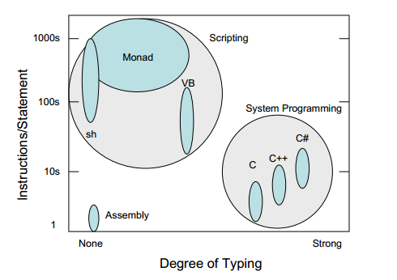

# Capítulo 2 – El Problema

Windows tiene herramientas administrativas GUI simples para usuarios básicos (Panel de control, MMC, etc.). Windows también tiene un rico conjunto de lenguajes, APIs [^2-1] y modelos de objetos para programadores de sistemas avanzados ([C](http://bit.ly/1SmIDVh), [C++](http://bit.ly/1HmcYe5), [C#](http://bit.ly/1EngdQ6), [WMI](http://bit.ly/1ekpnrY), [Win32](http://bit.ly/1IORfB2), .NET, etc.). Lo que falta, son herramientas “compuestas” vitales orientadas al administrador para escribir comandos y automatizar la gestión. El centro de todo esta normalmente regido por lenguajes de scripting.

Nuestras soluciones de secuencias de comandos actuales ([WSH](http://bit.ly/1ekpvra), [VB](http://bit.ly/1Q0VwjT)) se centran en el extremo superior del mundo de secuencias de comandos que gestionan la plataforma utilizando abstracciones de muy bajo nivel, como modelos de objetos complejos, esquemas y API [^2-2]. Esto puede resultar algo extraño para gran parte de la comunidad de administradores. El scripting  de administración debería fluir desde línea de comandos [^2-3], debería ser pequeño, simple, incremental y tratar con niveles de abstracción muy altos.

[John Ousterhout](http://web.stanford.edu/~ouster/cgi-bin/home.php) describió la distinción entre scripting y programación de sistemas en su artículo [Scripting: Higher Level Programming for the 21st Century](http://web.stanford.edu/~ouster/cgi-bin/papers/scripting.pdf).

[Ousterhout](http://web.stanford.edu/~ouster/cgi-bin/home.php) postula que las secuencias de comandos deben permitir "juntar" aplicaciones, una abstracción de nivel superior a la programación de sistemas, lo que permitía un desarrollo de aplicaciones aún más rápido que con los actuales lenguajes de programación. El argumento fundamental es que debemos continuar por el camino de la [Ley de Moore](http://www.mooreslaw.org) para llevar el desarrollo a niveles más altos de abstracción a través del scripting. Para habilitar la automatización de la administración en el mainstream, los administradores necesitan un shell completo, con scripts y utilitarios, y las [GUIs administrativas](https://notgartner.wordpress.com/2008/02/23/how-to-host-the-powershell-runtime/) necesitan estar superpuestas a esta infraestructura [^2-4]. Esto permitiría una formación eficiente de los administradores en la automatización desde la línea de comandos y garantizaría capacidades administrativas completas así como economías de escala en un modelo de automatización al que llama admin-composable.
___

**Notas**

[^2-1]: De hecho, las API son el diferenciador principal entre los sistemas Windows y [Linux/UNIX](http://www.cyberciti.biz/faq/what-is-the-difference-between-linux-and-unix/). En Linux/UNIX, todo se parece esencialmente a una carpeta o un archivo, y casi todos los bits de configuración se encuentran en un archivo de texto de estructura libre. La automatización de la administración en ese entorno es fácil, ya que sólo tiene una API: archivos de texto. Windows es más difícil porque para hacer algo, tiene que aprender alguna API - y todas las API son diferentes. Saber cómo agregar un usuario a [Active Directory](https://technet.microsoft.com/en-us/library/hh852274%28v=wps.630%29.aspx) no le ayuda a crear un sitio en [SharePoint](https://technet.microsoft.com/en-us/library/ff678226.aspx): todas son API diferentes.

[^2-2]: En otras palabras, no se alcanza el objetivo, porque [VBScript](https://msdn.microsoft.com/en-us/library/d1wf56tt%28v=vs.84%29.aspx) es básicamente una forma simplificada de tratar con las API que estaban destinadas a los desarrolladores. VBScript también asume que los equipos de producto han creado API dedicadas, compatibles con VBScript, lo que la mayoría no hizo. Conseguir algo con VBScript era a menudo complicado, y siempre a punta de prueba-error.

[^2-3]: (ORIGINAL) El scripting administrativo es a menudo la progresión de scripts ad hoc a operaciones automatizadas. Los administradores advierten que escriben los mismos comandos una y otra vez así que mejor construyen una secuencia de comandos. Ellos se percatan que sus secuencias de comandos siempre contienen muchas de las mismas cosas por lo que producen [subrutinas parametrizadas](https://technet.microsoft.com/en-us/magazine/jj554301.aspx) y avanzan desde allí.
 
[^2-4] Se tenía entonces una fuerte dependencia de las capas de GUIs. Eso explica un poco la ausencia de algunas GUIs administrativas en Linux/UNIX para algunas tareas. Su ausencia obliga a asegurarse que todo se puede hacer desde la línea de comandos. La GUI no se convierte en una clase especial de ciudadano que posee poderes especiales y únicos. Sólo es otro consumidor de la línea de comandos. La línea de comandos, a su vez, puede ser consumida más fácilmente por otros públicos diferentes a una GUI.
