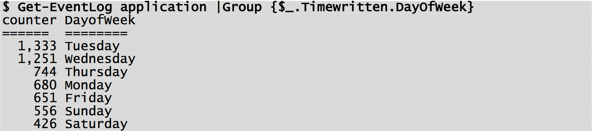

#Capítulo 5 - El modelo de automatización de Monad (MAM)
___
Monad define un modelo de automatización altamente apalancado para aplicaciones. El modelo extrae funciones comunes para que puedan implementarse una vez en el entorno de ejecución. Esto proporciona tanto apalancamiento para el desarrollador como coherencia para los administradores. El costo incremental para desarrollar y probar funciones específicas de la aplicación es bastante bajo en comparación con los métodos tradicionales.

Los desarrolladores exponen un modelo de automatización a los administradores como un conjunto de nombres y verbos fáciles de utilizar. El desarrollador las implementa subclasificando un conjunto de clases de automatización base de .NET, marcándolas con atributos de automatización para producir un conjunto de Cmdlets. El motor MSH expone estos cmdlets como un API y un conjunto de comandos. Los administradores y los desarrolladores de herramientas ahora obtienen una forma general de acceder uniformemente a la automatización de todos los aspectos del sistema operativo.

## 5.1 - Un ejemplo

Imagine al desarrollador que necesita exponer el registro de sucesos de Windows para la automatización de informes. El desarrollador decide cómo estructurar la automatización en términos de sustantivos y verbos ("Get-EventLog"). Monad proporciona una sólida orientación sobre este tema. El desarrollador escribe un CmdLet (en C #, VB.NET, COBOL, etc) para exponer esta función.

Un CmdLet podría verse así [^5-1]:

A primera vista puede parecer que el Admininistrador no va a obtener mucho uso de este código, pero nada podría estar más lejos de la realidad. El uso de los atributos CmdNoun y CmdVerb registra automáticamente este CmdLet como el comando **"Get-EventLog"** con un solo parámetro **"LogName"**. El Admininistrador entonces usa este comando junto con un conjunto de comandos de utilidad base para componer escenarios mucho más complejos

¿Qué está llenado el log de aplicación? [^5-2]

_¿Por qué MSI Installer está llenando el log?_

Al cambiar el último CmdLet en la canalización (pipeline), esta información se puede mostrar en XML, CSV, LIST, HTML, EXCEL o cualquier otro formato.

_¿El uso de mi registro de eventos es regular a lo largo de la semana?_

El administrador puede agregar Cmdlets adicionales a la canalización (pipeline) para filtrar sólo aquellos eventos que se generaron el martes y luego averiguar qué eventos ocurren más allá de ese día `($ Get-EventLog application |Where {$\_.TimeWritten.DayofWeek -eq "Tuesday"} |Group EventID)`. Después de haber encontrado el evento más frecuente de los martes, pueden filtrar fácilmente el registro para ese evento y determinar la distribución de dicho evento a través de los días de la semana. `($ Get-EventLog application |Where {$\_.EventID -eq 131080} |Group {$\_.TimeWritten.DayofWeek})`

Monad requiere una pequeña cantidad de código CmdLet [^5-3] para integrarse en el entorno de ejecución y aprovechar su rico conjunto de funciones y utilidades para proporcionar un potente y distinguido conjunto de funciones administrativas. Si bien este ejemplo se centró en una investigación ad hoc, es obvio cómo esta investigación podría conducir a un conjunto de informes nocturnos automatizados. Este ejemplo es un escenario sencillo. Los cmdlets completos necesitarían proporcionar una gama completa de verbos, hacer que las entradas se validen y realizar el manejo de errores. Sin embargo, los ahorros en desarrollo y prueba son dramáticos.

## 5.2 – Aprovechando .NET

Los desarrolladores utilizan los atributos .NET para descargar el trabajo al entorno de ejecución [^5-4]. La filosofía general de Monad es implementar las cosas una vez y luego usarlas en todas partes. Un rico conjunto de atributos declarativos dirigen el tiempo de ejecución de Monad para realizar acciones en nombre del desarrollador. Esto transfiere la responsabilidad de escribir y probar este código, así como de interactuar con el usuario durante las condiciones de error y producir y localizar mensajes de error.

Monad define los atributos de automatización en las siguientes áreas:

| | |
| --- | --- |
| Parsing Guidance | Indican al analizador cómo asignar la entrada del usuario al objeto de petición CmdLet. P.ej. Cómo asignar los parámetros a las propiedades, o si un calificador es obligatorio. |
| Data Generation | Dicen al shell que procese la entrada del usuario para generar los datos reales. También habrá procesadores para hostnames, ipaddrs, registrykeyames, ProcessNames, etc. |
| Data Validation | Expresan reglas de validación en los datos de entrada. P.ej. Cardinalidad de los datos, valores min/max de los datos, etc. |
| Encoding Directives | Transmiten la entrada del usuario procesada como objetos de datos. P.ej. Un CmdLet puede querer una matriz de StreamWriters en lugar de una matriz de nombres de archivo. |
| Object Processing | Realizan un conjunto de funciones comunes en tipos de datos comunes. P.ej. convertir una cadena a minúsculas, etc. |
| Visibility/Applicability | Proporcionan predicados para visibilidad/aplicabilidad. P.ej. Los cmdlets se pueden etiquetar con la máquina y las funciones del usuario. Si una máquina no tiene la función de servidor DHCP, los comandos del servidor DHCP no estarán visibles de forma predeterminada. |
| Documentation | Proporcionan información de utilidades sobre el elemento. P.ej. Ayuda |
| Test | Proporcionan sugerencias a las utilidades para facilitar la generación automática de matrices de prueba. |

---

_**Notas**_

[^5-1]: Brevemente, durante el desarrollo, los "cmdlets de script" de PowerShell (ahora, "funciones avanzadas") tenían una sintaxis similar a ésta. En C #, el código fuente del cmdlet todavía se parece mucho a esto.

[^5-2]: ORIGINAL: "Get-EventLog Application" es proporcionado por el código de ejemplo anterior y el resto proviene de los comandos de base de Monad. " Group source" cuenta el número de objetos que tienen el mismo valor para una propiedad en particular (es decir, cuántas veces apareció una fuente en particular). "Select -First 5" trunca el conjunto de objetos para que sólo tengan los primeros 5. "Format-Table" formatea los objetos y sus propiedades una tabla.

[^5-3]: Tenga en cuenta que incluso en este documento, Snover no era coherente acerca de "CmdLet" versus "Cmdlet". Hoy en día, "Cmdlet" es el estándar. Su idea original era enfatizar que un "Cmdlet" no era un "comando completo" con todo el análisis sintáctico, pero no era un comando tradicional implementado. En su lugar, era parte de un comando, con gran parte de la sobrecarga proporcionada por las clases base del motor de automatización.

[^5-4]: Significado, un desarrollador .NET puede indicar al runtime .NET que realice ciertas tareas estandarizadas. Esto se ve mucho en PowerShell: por ejemplo, una función puede declarar un parámetro como obligatorio y el shell aplicará ese atributo en lugar de que el desarrollador de funciones tenga que escribir la lógica para hacerlo.

