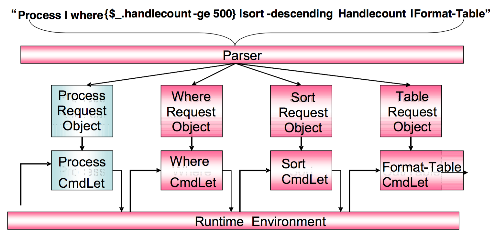
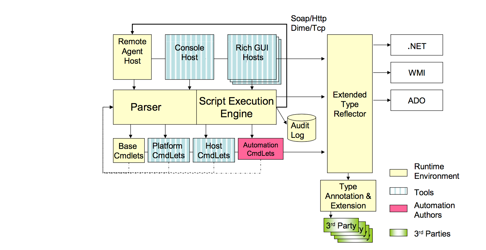

# Capítulo 6 - El Shell Monad (MSH)
Monad proporciona un entorno de tiempo de ejecución para crear APIs, líneas de comandos e interfaces gráficas altamente coherentes, poderosas, detectables y seguras mediante la creación de pipelines de cmdlets. Esta capacidad se suministra como una clase .NET que se puede integrar en una serie de "hosts" que exponen dicha funcionalidad al usuario. El término MSH se refiere tanto al entorno de ejecución como al host que expone el uso como un shell interactivo de línea de comandos.

## 6.1 - Canalización de objetos (Pipelines) .NET
Monad procesa la entrada del usuario, construye una canalización (Pipeline) de Cmdlets para cada uno de los comandos ingresados, analiza y codifica la entrada del usuario para cada comando en un objeto de petición CmdLet (CRO-CmdLet Request Object). El motor de ejecución de secuencias de comandos “ensambla” la ejecución para luego invocar primer Cmdlet pasando su CRO como un parámetro. Este Cmdlet devuelve un conjunto de objetos .NET que luego se procesan y pasan al siguiente Cmdlet junto con su CRO y así sucesivamente hasta que la Canalización (pipeline) se complete.

Pasar objetos .NET a cmdlets en lugar de flujos de texto permite que las utilidades basadas en Reflection proporcionen una función para cualquier objeto .NET. En el ejemplo anterior, **WHERE** CmdLet filtra un conjunto de objetos basándose en una prueba de las propiedades del objeto. Resuelve objetos de cualquier tipo (por ejemplo, Procesos, Archivos, Discos, etc.) y consultas para su tipo utilizando las API de Reflection de .NET. Mediante el tipo, consulta la existencia de la propiedad especificada por el usuario ("HandleCount"). Luego, utiliza esta información para consultar cada objeto para el valor de dicha propiedad y finalmente realiza la prueba en esa propiedad para filtrar el objeto apropiadamente.

El mismo mecanismo es utilizado por **SORT** CmdLet para ordenar un conjunto de objetos y el **FORMAT-TABLE** CmdLet para mostrar las propiedades de un conjunto de objetos como una tabla. Las utilidades de Monad facilitan el procesamiento de las funciones comunes de los Cmdlets, lo que ahorra costes para el desarrollador y aumenta la potencia/consistencia de los administradores.

La integración de comandos heredados [^6-1] es trivial porque los flujos de texto son simplemente un tipo de flujo de objetos .NET. Dicho esto, una vez traducido a texto, se pierde la capacidad de operar sobre él como un objeto rico basado en Reflection para regresar de vuelta al mundo del análisis de texto.

## 6.2 - Componentes del entorno de tiempo de ejecución de Monad
El siguiente diagrama ilustra los principales componentes del entorno de tiempo de ejecución de Monad.

#### 6.2.1.1 - El analizador
El analizador de Monad es utilizado por todos los Cmdlets y garantiza una sintaxis coherente. Es responsable de analizar la entrada del usuario para el motor de ejecución de secuencias de comandos. Cuando un usuario introduce una línea de comandos, el analizador asigna el comando a un método CmdLet y su Cmdlet Request Object. Los campos y atributos del objeto de petición se utilizan para analizar el resto de la línea de comandos, generar cualquier información adicional, validar la entrada y codificar esos valores en el objeto de petición.

Al realizar este proceso, el analizador puede agregar metadatos proporcionados por el objeto Request con metadatos proporcionados por proveedores de terceros. Por ejemplo, un objeto de solicitud puede indicar que puede aceptar hasta 16 nombres de nodo y que los nombres deben resolver a una dirección IPv4. Una directiva no puede cambiar esas directivas, pero podría añadir una directiva que indique que los nodos deben responder actualmente a un ping ICMP (por ejemplo, IsAlive).

#### 6.2.1.2 - El motor de ejecución de secuencias de comandos
El motor de ejecución de secuencias de comandos Monad encadena los cmdlets y garantiza una experiencia de ejecución consistente. También es responsable de tomar las canalizaciones (pipelines) codificadas por el analizador y realizar todas las operaciones necesarias para secuenciarlas hasta su finalización. Si las acciones deben ocurrir en una máquina remota o un conjunto de máquinas remotas, se coordina con la [MRS](https://www.penflip.com/powershellorg/monad-manifesto-annotated/blob/master/chapter-8-the-monad-remote-script-mrs.txt) y además registra todas las actividades en el registro de auditoría. El motor de ejecución observa el flujo de datos entrante y encuentra las propiedades correctas para enlazar en un CmdLet (un CmdLet puede tener varios parámetros para aprovechar diferentes tipos de datos). La salida de un CmdLet se recoge, se procesa y se pasa a las propiedades apropiadas del siguiente CmdLet. Dado que el entorno de tiempo de ejecución se puede incrustar en varios hosts (por ejemplo, línea de comandos, GUI, etc.), es importante que un CmdLet nunca se comunique directamente con el usuario. El motor de ejecución de secuencias de comandos media esta actividad entre el CmdLet y los distintos hosts.

#### 6.2.1.3 - Los Cmdlets
Los cmdlets realizan acciones. Hay cuatro tipos de Cmdlets: 1) Base 2) Host 3) Plataforma y 4) Usuario. Los cmdlets **Base** funcionarán en cualquier entorno .NET, como Sort, Where, Group, etc. Los cmdlets de **Plataform** son aquellos que dependen de una plataforma determinada (XP, Smart Phone o Compact Framework) y no están disponibles en otras plataformas. Los cmdlets de **Host** son aquellos proporcionados por la aplicación que incorpora el entorno de tiempo de ejecución de Monad. Por ejemplo, msh.exe o GUI de administración que exponen Cmdlets específicos para ese host (por ejemplo, Cambiar una fuente, cerrar una ventana, etc.). Los Cmdlets de **User** son los escritos por el usuario. Estos pueden ser escritos en cualquier lenguaje (C #, VB.NET, etc), pero la mayoría se escribirá en MSH (el lenguaje shell).

El identificador único de estos Cmdlets es su tipo .NET (por ejemplo, System.Command.ProcessCmdLet). Aunque este identificador siempre se puede utilizar para invocar el CmdLet, es largo y hostil. Como tal, los autores de CmdLet están obligados a proporcionar nombres amistosos a través de atributos.

Será bastante común y fácil que los Cmdlets de mayor orden se implementen obteniendo un conjunto de datos y luego utilizando el tiempo de ejecución de Monad para invocar un script en esos datos y devolver los resultados de ese script.

#### 6.2.1.4 - El reflector de tipo extendido
El poder de Monad es su capacidad de aprovechar la reflexión (Reflection) de .NET. El problema es que hay objetos que están codificados en formas que despojan el poder de la reflexión. Por ejemplo, cuando se reflejan contra datos como Datables ADO, donde las propiedades están “encapsulados” como columnas. En esto escenario lo que necesitamos son los nombres de las columnas, pero estos se codifican de forma diferente. Un problema similar existe con WMI, Active Directory y XML. El reflector de tipo extendido está diseñado para abordar estos problemas.

#### 6.2.1.5 - El Sistema de Anotación y Extensión de Tipo
Tratar con los objetos en crudo proporciona a veces demasiada y otras veces muy poca información. Es el trabajo del tipo anotación y sistema de extensión resolver esta paradoja, proporcionando un mecanismo para que terceras partes definan conjuntos de propiedades (por ejemplo, propiedades asociadas con el rendimiento, la configuración, el consumo de recursos o las dependencias) y dar al conjunto un nombre público. Esto permite al usuario dar un nombre en lugar de tener que especificar cada propiedad. P.ej. "Format-Table resources " vs. " Format-Table name ,pid, workingset, handlecount, virtualmemory, privatememory".

Monad proporciona acceso a los objetos y los métodos sobre esos objetos. Sin embargo, los métodos intrínsecos de un objeto representan un número muy pequeño de las cosas interesantes que los usuarios quieren hacer. El mecanismo de extensión de tipo permite que terceras partes registren métodos intermedios en esos objetos. Estos métodos pueden ser accedidos utilizando la misma sintaxis que los nativos, pero este sistema los enviará al método apropiado de terceros, pasando el objeto original como un parámetro.

#### 6.2.1.6 - El Agente Remoto
Los usuarios podrán ejecutar secuencias de comandos en máquinas remotas a través de solicitudes de servicio Web para el host de agente remoto. Este host incorporará el tiempo de ejecución y responderá a las solicitudes recibidas vía SOAP/HTTP o DIME/TCP. Los usuarios serán autenticados y sus actividades autorizadas (ya sea por ID o por ROLE). Las solicitudes y las respuestas se codificarán de manera que permitan la cancelación y el rastreo de las actividades locales a solicitudes específicas en los registros de auditoría remota.

Cuando una secuencia de comandos está completa, sus objetos de retorno se serializan por valor para la transmisión a través de la red.

#### 6.2.1.7 - Seguridad

Monad podría ser uno de los entornos de shell más seguros jamás creados. Todas las acciones se consignan en un registro de auditoría. Las facilidades de identificación de código proporcionadas por .NET reducen significativamente la exposición a una de los problemas de seguridad más comunes en un entorno de shell: Troyanos. Firmas, nombres fuertes y hashes en la política del sistema se utilizarán para identificar qué utilidades son legítimas y están aprobadas así como para  evitar que troyanos conocidos se ejecuten.

En resumen, el shell de Monad minimiza las exposiciones de seguridad y facilita la detección y corrección de las brechas de seguridad.

#### 6.2.1.8 - Host MSH
MSH es un ensamblado .NET que se puede incrustar en cualquier host ejecutable para proporcionar ejecución de scripts y acceso a Cmdlets. Los hosts son capaces de determinar qué subconjunto de Cmdlets se ponen a disposición del usuario. El caso más común es que un Host expone todos los Cmdlets de Base (por ejemplo, ordenar, filtar, etc.), todos sus Cmdlets de Host (por ejemplo, Outlook expondría Cmdlets para tratar con buzones y mensajes) y un subconjunto apropiado de los Cmdlets de Plataforma Cmdlets que tratan de procesos, discos, adaptadores de red, etc.).

MSH es también un ejecutable autónomo que aloja el motor de ejecución de secuencias de comandos y proporciona una rica experiencia interactiva al mismo tiempo que una experiencia de tipo vt100 convincente. MSH proporciona capacidades gráficas complejas como Intellisense para completar el comando. Los datos se pueden imprimir en formatos gráficos para aprovechar las capacidades de interacción y visualización de las PC.

## 6.3 - Lenguaje de secuencias de comandos de MSH
MSH proporciona un lenguaje de scripting completo utilizando las funciones y la sintaxis del modelo POSIX Shell (control de flujo, manejo de fallas, variables, definición de funciones, alcance, redireccionamiento IO, etc.) como punto de partida, para mejorar la experiencia de programación, aprovechar la nueva funcionalidad o proporcionar una ruta de evolución a C#. El objetivo es que los administradores de UNIX que trabajen con Windows encuentren fácil aprender y migrar sus habilidades a MSH.

Además de escribir funciones tradicionales, los usuarios pueden usar las capacidades de secuencias de comandos de MSH para escribir sus propios Cmdlets y para agregar o reemplazar verbos a los sustantivos existentes de CmdLet.

___

**Notas**

[^6-1]: ORIGINAL: MSH podrá invocar de forma transparente los comandos heredados y los shells heredados podrán invocar sin problemas MSH CmdLets. (MSH proporcionará un mecanismo para exportar CmdLets para el acceso desde los shells heredados) [De hecho, PowerShell nunca implementó una forma fácil de invocar cmdlets para comandos heredados].
