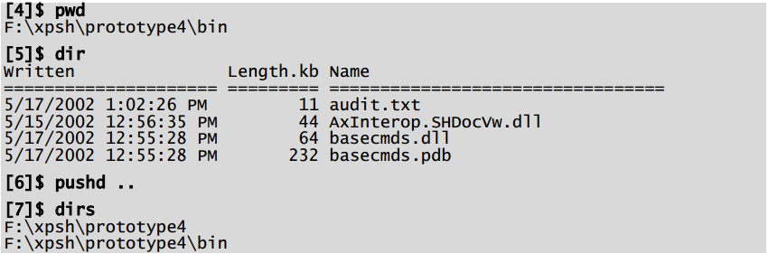
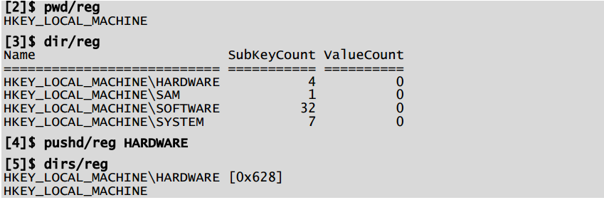

# Capítulo 7 - Modelos de gestión de Monad (MMM)
Monad ayuda a los desarrolladores de aplicaciones a diseñar la experiencia administrativa proporcionando un conjunto de modelos de gestión. Un MMM es un conjunto rico de clases base de automatización basadas en escenarios y una herramienta o conjunto de herramientas que utilizan esas clases para realizar un escenario de administración particular. Estas clases bases cubren los principales escenarios de administración, incluyendo: Navegación, Diagnóstico, Configuración, Ciclo de vida y Operaciones. Las clases base proporcionan una forma común de realizar estas tareas en varios tipos de recursos. Esto permite al administrador aprender un modelo para gestionar un escenario en particular y luego aplicar ese modelo a una amplia gama de problemas y nuevas situaciones. Los desarrolladores seleccionan el conjunto apropiado de clases base, derivan sus propias clases de éstas e implementan los métodos apropiados para sus tipos de recursos. Las clases base proporcionan lo siguiente:

1. Un conjunto de verbos para el escenario (por ejemplo, Navigation tiene el conjunto de verbos: pwd, cd, dir, pushd, popd, dirs)
2. Un conjunto de objetos de solicitud base que definen calificadores comunes. P.ej. Si el escenario se refiere a una máquina remota, el objeto de petición base definiría un calificador común -MACHINENAME. Esto disuade a la gente de usar los términos: NODE, SERVER, HOST, etc.
3. Un conjunto de excepciones y mensajes de error para ese escenario. P.ej. Habrá una excepción esquematizada estándar para "Recurso no disponible" para que no terminemos con decenas de variaciones [que existen hoy en día].
4. Soluciones comunes a problemas de escenario comunes. P.ej. Las clases base proporcionarán una solución estándar para el problema de que alguien pida accidentalmente demasiada información [por ejemplo, obtener todos los objetos en LDAP].

Microsoft localizará todas las partes visibles de estos escenarios (verbos, calificadores, mensajes de error, etc.) para que los ISVs puedan reducir significativamente sus costos de desarrollo mediante el aprovechamiento de estas clases base. Además de estos beneficios, Monad proporciona controles de interfaz de usuario para mostrar gráficamente e interactuar con implementaciones de estas clases base. Monad enrá con un plug-in MMC de herramientas que alojan estos controles de interfaz de usuario, pero los ISV o los desarrolladores internos pueden alojar los controles en sus propias UI de administración. Dado que estos controles tendrán acceso a interfaces de datos y control bien definidos, terceras partes también pueden crear controles de reemplazo.

## Un ejemplo
La navegación proporciona un ejemplo de un modelo de gestión. Habrá una clase base para todos los Cmdlets que quieran hacer Navigation. Esto definirá los verbos (pwd, cd, pushd, dirs, popd, dir), mensajes de error comunes y proporcionará implementaciones comunes para problemas comunes (pushd, dirs y popd se implementarán una vez). Esa clase base puede ser “subclaseada” para proporcionar una experiencia de administración consistente con una cantidad mínima de código. Una vez que el administrador aprende cómo usar este modelo, podrá utilizarlo en una amplia gama de recursos. Navegar el sistema de archivos será el caso por defecto:

Los mismos comandos se pueden utilizar para explorar el Registro:

Los mismos comandos se pueden utilizar para explorar el sistema de Ayuda, Active Directory, bases de datos SQL, WMI u otros espacios de nombres.

